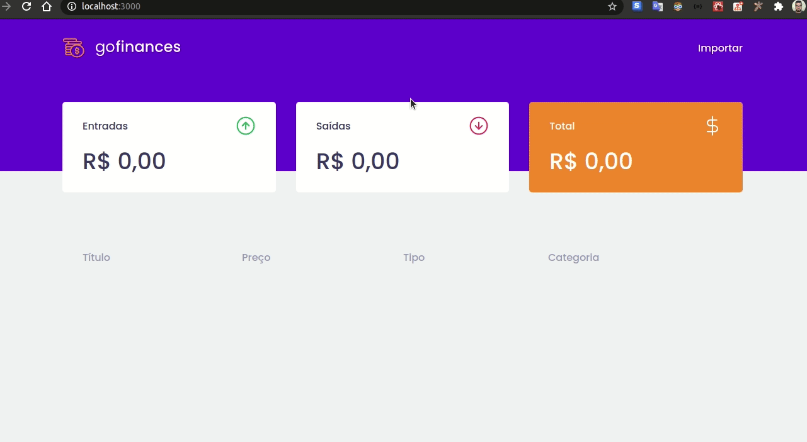

# Go Finances

A frontend app to show data from a nodejs api.

A webapp that manages the an account's input/output.

## App

## Why

The fourth module's course Go Stack from [Rocket Seat](https://github.com/Rocketseat). I'm adding this project for my personal portifolio, so if you could let me any feedback I'd appreciate so much. Any comment that can make me a better programmer will be help a lot!

And for sure, you can use this Project as you wish!

It's free!

## Contact info

My [LinkedIn](https://www.linkedin.com/in/bruno8moura/)

My email bruno8moura@gmail.com

## Getting started

### Prerequisites

NodeJS version: ^12

## Running application

yarn start

## Build with

- [axios](https://www.npmjs.com/package/axios) - A lib ot make http requests. It is a good choice because we can patterned the url base for a especifi domain.
- [filesize](https://www.npmjs.com/package/filesize) - Provides a simple way to get a human readable file size string from a number (float or integer) or string.
- [history](https://www.npmjs.com/package/history) - A simple way to manage the session history in browser.
- [polished](https://www.npmjs.com/package/polished) - Tool for creating styles for your html.
- [react](https://www.npmjs.com/package/react) - The core library for React.
- [react-dom](https://www.npmjs.com/package/react-dom) - Enable React to communicate with HTML throught the DOM API.
- [react-dropzone] - Enable the component of drag and drop zone for files.
- [react-router-dom](https://www.npmjs.com/package/react-router-dom) - DOM bindings for React Router.
- [react-scripts](https://www.npmjs.com/package/react-scripts) - Scripts and configurations used by 'create-react-app' app.
- [styled-components](https://www.npmjs.com/package/styled-components) - A powerful tool that helps in css organization, isolating the css by components.
- [typescript](https://www.npmjs.com/package/typescript) - Superset of features for javascript language.

